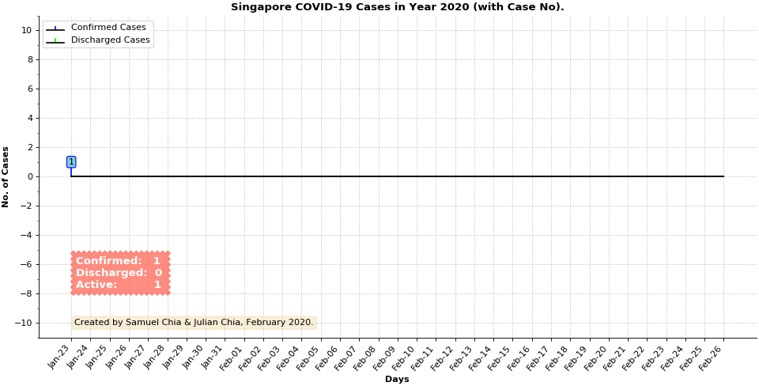

# Coronavirus Disease 2019 (COVID-19) Case Monitor

This animation shows the **"Confirmed"**, **"Discharged"** and **"Active"** COVID-19 cases in Singapore, as of 26th February 2020. It was created using the program `covid19_case_monitor.py`, which is written using [Python 3.6](https://www.python.org/) & [Mathplotlib 3.1.3](https://matplotlib.org/3.1.0/index.html).

### Execution

 1. Clone / download this repository into a directory.
 
 2. Open a terminal and go to the same directory as used in step 1 and type:

    `$ python3.6 covid19_case_management.py`

The program will generate a `.gif` animation file of the confirmed and discharged case histories given in the files `Cases_Confirmed.txt`  and `Cases_Discharged.txt`. You have to update these files to create an updated `.gif` animation. 

### Remarks

- We hope this program can help the current efforts in monitoring and understanding the COVID-19 epidemic.
- Singapore's "Active" COVID-19 cases appears to be declining. We pray this trend continues. 

### Authors
Samuel and Julian Chia
